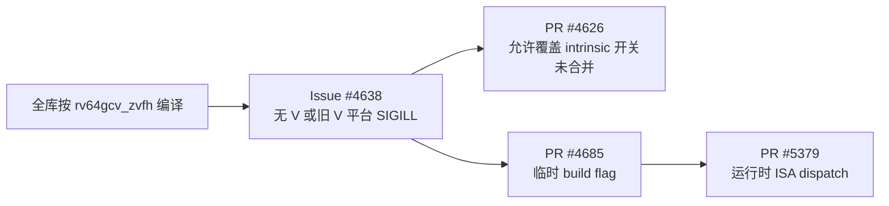

# oneDNN RISC-V（RV64/RVV）开发与缺陷修复历史

> 调研基线：`8f49eae32bdec3674a9a98ea1524a85cd1f302db`（oneDNN 3.14.0）
> 调研日期：2026-08-26
> 配套资料：[RV64 源码地图](source_maps/03-rv64-source-map.md)
> 用途：为 RV64 路径缺陷审计建立演进背景、已知问题谱系和优先检查线索。

## 1. 结论摘要

oneDNN 的 RISC-V 支持不是一次完成的移植，而是经历了四次明显的能力跃迁：

1. 2021 年先加入 RV64 架构识别，使 generic C++ 路径可以显式面向 RISC-V 构建。
2. 2022 年底至 2024 年以 RVV pooling 为第一个优化实现，同时补齐 intrinsic/toolchain 探测。
3. 2025 年快速扩展 MatMul、GEMM、convolution、binary、normalization、softmax、post-op 和 CI。
4. 2025 年底引入 Xbyak_riscv 后，后端在 2026 年转向 JIT，并于 2026 年 6 月完成运行时 ISA
   分派的关键迁移。

历史缺陷高度集中在以下边界，而不是平均分布在所有代码中：

- primitive descriptor（PD）接受了内核没有真正实现的属性、布局或数据类型；
- padding、空窗口、尾块和大维度破坏了循环或地址计算假设；
- RVV 指令语义与 oneDNN 参考语义在 `NaN`、`-INF`、负值和 ReLU alpha 上不一致；
- 编译期 `-march`、intrinsic 可用性和运行时 CPU 能力曾经混在一起；
- 优化 PR 的常规测试没有覆盖新路径，问题在后续 CI、评审或特制 benchdnn case 中才出现。

因此，后续审计应优先检查“声明支持—实际执行—fallback”三者的一致性，以及跨 primitive
复用的 JIT injector、GEMM/BRGEMM、post-op 和 ISA 能力层。

## 2. 调研范围与口径

本地 Git 统计覆盖以下直接路径：

```text
src/cpu/rv64/
cmake/toolchains/riscv64.cmake
.github/automation/riscv/
.github/workflows/ci-riscv.yml
.github/workflows/weekly-riscv.yml
```

截至基线，这些路径共有 233 个可达提交：

| 年份 | 路径相关提交数 |
|---|---:|
| 2022 | 1 |
| 2023 | 6 |
| 2024 | 2 |
| 2025 | 87 |
| 2026（截至 8 月 26 日） | 137 |

2021 年的架构宏改动位于共享 CPU/CMake 文件，不在上面的直接路径计数中。提交数也不等同于 PR 数：
早期 PR 常由多个普通提交组成，后期多使用 squash merge。本文以本地完整 Git 历史为主线，再用
oneDNN 官方 GitHub 仓库中的 PR、Issue、评论和关闭时间核验。

“修复”只用于 PR/Issue 明确描述了错误、崩溃、越界、未定义行为或不兼容的情况；纯性能优化、
重构和新增能力不会被误记为 bugfix。GitHub 状态均以调研日期为准。

## 3. 总体时间线


### 3.1 2021：先解决“能识别、能构建”

- [Issue #1146](https://github.com/uxlfoundation/oneDNN/issues/1146) 请求加入 RV64 支持；当时
  generic C++ 实现已经能够编译，但缺少显式的目标架构入口。
- [PR #1148](https://github.com/uxlfoundation/oneDNN/pull/1148) 于 2021-09 合并，加入 RISC-V
  架构定义并关闭该 Issue。这一阶段没有 RV64 专用优化内核。

### 3.2 2022-12—2024：pooling 原型与工具链护栏

- [PR #1521](https://github.com/uxlfoundation/oneDNN/pull/1521) 是直接 `src/cpu/rv64`
  路径的起点：2022-12 开始开发，2023-02 合并 NCHW RVV pooling。
- [PR #1677](https://github.com/uxlfoundation/oneDNN/pull/1677) 随即暴露第一个明确的数值正确性
  问题：max pooling 用 `FLT_MIN` 初始化最大值，导致全负输入错误地得到接近零的结果。
- [PR #2053](https://github.com/uxlfoundation/oneDNN/pull/2053) 修复 RV64 构建所需头文件缺失；
  [PR #2195](https://github.com/uxlfoundation/oneDNN/pull/2195) 增加 RVV intrinsic 编译探测。
- [Issue #1848](https://github.com/uxlfoundation/oneDNN/issues/1848) 记录了当时 RV64 仅支持
  sequential runtime 的构建限制；报告者使用 `ONEDNN_CPU_RUNTIME=SEQ` 后关闭问题，未对应代码修复。

这一阶段的特征是单一算子、intrinsic 直写和强构建环境假设。最早的 bug 已经提示：RVV 指令或常量
看似自然的选择，未必符合 oneDNN 的参考数值语义。

### 3.3 2025-03—2025-08：RVV 1.0 适配和 pooling 稳定化

- [PR #2929](https://github.com/uxlfoundation/oneDNN/pull/2929) 更新 RVV intrinsic 接口。
- [PR #3449](https://github.com/uxlfoundation/oneDNN/pull/3449) 优化 max pooling，
  [PR #3460](https://github.com/uxlfoundation/oneDNN/pull/3460) 增加 average pooling。
- [PR #3455](https://github.com/uxlfoundation/oneDNN/pull/3455) 尝试动态选择 `-march`，但随后的
  [PR #3486](https://github.com/uxlfoundation/oneDNN/pull/3486) 明确修复其探测时没有向试编译加入
  `-march=rv64gcv`、因而错误判断编译器能力的问题。
- [PR #3457](https://github.com/uxlfoundation/oneDNN/pull/3457) 同时修复两类缺陷：默认 format
  尚未设置就调用 `is_dense()` 导致优化内核被错误跳过；padding/stride 形成空窗口时继续访问内存，
  导致 max pooling 越界和段错误。

这个阶段形成了一个反复出现的模式：优化路径能否被选中、其 PD 是否接受了正确范围，与内核本身的
计算逻辑同样关键。

### 3.4 2025-08—2025-12：从 pooling 扩展为多算子后端

代表性开发节点如下：

| 方向 | 代表性 PR | 历史意义 |
|---|---|---|
| MatMul/GEMM | [#3784](https://github.com/uxlfoundation/oneDNN/pull/3784) | RVV row/column kernel、bias、ReLU post-op |
| F32 GEMM | [#3785](https://github.com/uxlfoundation/oneDNN/pull/3785) | 建立可复用 SIMD GEMM 路径 |
| Zvfh | [#3850](https://github.com/uxlfoundation/oneDNN/pull/3850) | 构建期探测半精度向量扩展 |
| Binary | [#3899](https://github.com/uxlfoundation/oneDNN/pull/3899) | 增加 RVV binary primitive |
| Convolution post-op | [#3852](https://github.com/uxlfoundation/oneDNN/pull/3852) | 用 RVV intrinsic 向量化 convolution post-op |
| CI | [#3963](https://github.com/uxlfoundation/oneDNN/pull/3963) | 建立 RISC-V QEMU CI workflow |
| Pooling | [#3970](https://github.com/uxlfoundation/oneDNN/pull/3970) | 增加 NHWC 路径 |
| 归一化/Softmax | [#4158](https://github.com/uxlfoundation/oneDNN/pull/4158)、[#4173](https://github.com/uxlfoundation/oneDNN/pull/4173) | 从矩阵计算扩展到常用神经网络算子 |
| Post-op | [#4281](https://github.com/uxlfoundation/oneDNN/pull/4281) | 建立共享 eltwise/post-op 能力 |
| 运行时 Zvfh | [#4322](https://github.com/uxlfoundation/oneDNN/pull/4322) | 从纯构建期判断走向运行时能力检查 |

同期的 RVV convolution [PR #3915](https://github.com/uxlfoundation/oneDNN/pull/3915) 和 F16 MatMul
[PR #3933](https://github.com/uxlfoundation/oneDNN/pull/3933) 均关闭且未合并，不能视为当前基线的功能落地。
RV64 F16/BF16 MatMul JIT 最终到 2026-08 才由
[PR #5846](https://github.com/uxlfoundation/oneDNN/pull/5846) 合并。

[Issue #3934](https://github.com/uxlfoundation/oneDNN/issues/3934) 是扩张期的重要警告：RV64 MatMul
错误接受 dropout attribute，最终由 [PR #4197](https://github.com/uxlfoundation/oneDNN/pull/4197)
增加属性检查解决。修复策略不是“假装执行 dropout”，而是让不支持的优化实现拒绝该 descriptor，
使实现选择机制继续寻找合法 fallback。

### 3.5 2025-11—2026-04：Xbyak_riscv、JIT 和 BRGEMM 主线

- [PR #4363](https://github.com/uxlfoundation/oneDNN/pull/4363) 将 MatMul 与 GEMM kernel 集成；
  [PR #4445](https://github.com/uxlfoundation/oneDNN/pull/4445) 随后修复该路径允许 column-major
  权重，却按 row-major 解释并产生错误结果的问题。
- [PR #4395](https://github.com/uxlfoundation/oneDNN/pull/4395) 在 2025-12 引入
  `third_party/xbyak_riscv`，是后端从 intrinsic 实现转向 JIT 的分水岭。
- [PR #4410](https://github.com/uxlfoundation/oneDNN/pull/4410)、
  [#4545](https://github.com/uxlfoundation/oneDNN/pull/4545)、
  [#4608](https://github.com/uxlfoundation/oneDNN/pull/4608) 分别扩展 JIT GEMM、1x1 convolution
  和 JIT code 注册/dump。
- [PR #4537](https://github.com/uxlfoundation/oneDNN/pull/4537) 修复 `jit_generator` 的 Clang
  编译错误，说明 emitter/JIT 基座已经成为跨算子的构建关键点。
- [PR #4548](https://github.com/uxlfoundation/oneDNN/pull/4548) 向 GEMM convolution 的 im2col
  加入向量路径；随后 [PR #4637](https://github.com/uxlfoundation/oneDNN/pull/4637) 修复重复偏移、
  width padding 下错误结果和越界读取，并重新启用对应 CI 测试。
- [PR #4770](https://github.com/uxlfoundation/oneDNN/pull/4770)、
  [#4824](https://github.com/uxlfoundation/oneDNN/pull/4824)、
  [#4840](https://github.com/uxlfoundation/oneDNN/pull/4840) 将 BRGEMM 用于 convolution、通用 f32
  kernel 和 inner product。
- [PR #4890](https://github.com/uxlfoundation/oneDNN/pull/4890) 修复
  `softmax_accurate_inf_as_zero` 遇到整行 `-INF` 时由 `-INF - -INF` 生成 NaN 的问题。
- [PR #4955](https://github.com/uxlfoundation/oneDNN/pull/4955) 重新切分 weekly CI，缓解 QEMU
  下全量正确性测试的时限压力。

### 3.6 2026-02—2026-06：从全局 `-march` 迁移到运行时 ISA 分派

这是 RV64 历史上最重要的一条架构修复链：



[Issue #4638](https://github.com/uxlfoundation/oneDNN/issues/4638) 指出：即使调用点增加
`mayiuse(v)`，只要全库用 `-march=rv64gcv_zvfh` 编译，编译器仍可在任意代码中生成 RVV 指令，
使 `rv64gc` 或只支持旧 RVV 的机器触发 `SIGILL`。讨论确认这是从编译期特性选择迁移到真正运行时
分派时的系统性缺口。

- [PR #4626](https://github.com/uxlfoundation/oneDNN/pull/4626) 提议允许覆盖 intrinsic 开关，
  但关闭时未合并。
- [PR #4685](https://github.com/uxlfoundation/oneDNN/pull/4685) 作为临时方案加入精确的 RV64
  build flag，并在 2026-02 关闭 Issue #4638。
- [PR #5379](https://github.com/uxlfoundation/oneDNN/pull/5379) 于 2026-06 将后端切换到运行时
  ISA 分派；Issue 后续讨论把它称为完成全 RISC-V JIT 迁移的里程碑。

这条链说明审计不能只检查 `mayiuse()`：还要确认基线 translation unit 不会被全局编译选项污染，
ISA-specific 代码的生成、注册和调用三处都受到正确约束。

### 3.7 2026-05—2026-08：覆盖面和数据类型快速收敛

这一阶段的主要工作包括：

- [PR #5079](https://github.com/uxlfoundation/oneDNN/pull/5079) 的 f32 binary JIT；
- [#5135](https://github.com/uxlfoundation/oneDNN/pull/5135)、
  [#5150](https://github.com/uxlfoundation/oneDNN/pull/5150) 的 GEMM/BRGEMM bias fusion；
- [#5157](https://github.com/uxlfoundation/oneDNN/pull/5157) 的 BRGEMM MatMul；
- [#5198](https://github.com/uxlfoundation/oneDNN/pull/5198)、
  [#5231](https://github.com/uxlfoundation/oneDNN/pull/5231) 的 NHWC/NCHW pooling JIT；
- [#5239](https://github.com/uxlfoundation/oneDNN/pull/5239) 为 MatMul、dot、convolution、softmax
  和 pooling 集中加入 JIT kernel；
- [#5265](https://github.com/uxlfoundation/oneDNN/pull/5265)、
  [#5294](https://github.com/uxlfoundation/oneDNN/pull/5294)、
  [#5403](https://github.com/uxlfoundation/oneDNN/pull/5403)、
  [#5846](https://github.com/uxlfoundation/oneDNN/pull/5846) 扩展 F16/BF16；
- [#5453](https://github.com/uxlfoundation/oneDNN/pull/5453)、
  [#5506](https://github.com/uxlfoundation/oneDNN/pull/5506)、
  [#5718](https://github.com/uxlfoundation/oneDNN/pull/5718)、
  [#5850](https://github.com/uxlfoundation/oneDNN/pull/5850) 扩展 PReLU、pooling backward、
  resampling 和 shuffle；
- [#5538](https://github.com/uxlfoundation/oneDNN/pull/5538) 在 CI 中启用向量浮点扩展。

功能快速增长的同时，修复开始更多地落在共享基础设施和语义一致性上：post-op、NaN、通用循环、
scratchpad、fallback 和实现路由，而不再只是某个算子的单一公式错误。

## 4. 已确认 bugfix 谱系

### 4.1 数值和特殊值语义

| PR | 症状与根因 | 修复方向 | 审计启示 |
|---|---|---|---|
| [#1677](https://github.com/uxlfoundation/oneDNN/pull/1677) | max pooling 以 `FLT_MIN` 初始化；全负输入返回错误结果 | 改用最低有限负值 | reduction 初值必须按算法语义选择 |
| [#4890](https://github.com/uxlfoundation/oneDNN/pull/4890) | 全 `-INF` 行计算 `src - max` 产生 NaN | 对 `inf_as_zero` 特例显式归零 | 检查所有特殊值组合和 f32/f16 一致性 |
| [#5174](https://github.com/uxlfoundation/oneDNN/pull/5174) | 默认 post-op helper 忽略 ReLU alpha | 保存并执行 `x > 0 ? x : alpha*x` | injector 参数不能只验证而不消费 |
| [#5194](https://github.com/uxlfoundation/oneDNN/pull/5194) | 普通 MatMul CI 未覆盖非默认 ReLU alpha | 加入回归 case | 测试必须改变默认属性值才能验证属性确实生效 |
| [#5370](https://github.com/uxlfoundation/oneDNN/pull/5370) | `vfmin/vfmax` 使 NaN 被零或边界值替换，影响 ReLU、clamp、ELU、EXP、binary、pooling 和融合路径 | 使用显式 compare + merge 保留 NaN | 一处 injector/辅助函数错误可横跨多个 primitive |

### 4.2 内存安全、边界和未定义行为

| PR | 风险 | 根因/修复 |
|---|---|---|
| [#3457](https://github.com/uxlfoundation/oneDNN/pull/3457) | 空 pooling window 导致越界和段错误 | 对 `iw_start >= iw_end` 加保护 |
| [#4637](https://github.com/uxlfoundation/oneDNN/pull/4637) | im2col 在 width padding 下错误寻址并可能越界读取 | 修正重复 offset；padding 时回退 scalar 路径 |
| [#5593](https://github.com/uxlfoundation/oneDNN/pull/5593)、[#5594](https://github.com/uxlfoundation/oneDNN/pull/5594) | `int` counter 与 `dim_t` bound 比较，超 `INT_MAX` 后有符号溢出，可错误、死循环或越界 | 将 counter 扩宽到 `dim_t`/`ptrdiff_t`；其中 #5594 覆盖 RV64 |

### 4.3 descriptor、布局和实现路由

| PR/Issue | 问题 | 修复或结论 |
|---|---|---|
| [#3457](https://github.com/uxlfoundation/oneDNN/pull/3457) | format 默认值未设置就做 dense 检查，RVV kernel 被误跳过 | 提前 `set_default_params()` |
| [Issue #3934](https://github.com/uxlfoundation/oneDNN/issues/3934) / [#4197](https://github.com/uxlfoundation/oneDNN/pull/4197) | MatMul RV64 实现接受不支持的 dropout attribute | 在 PD 阶段拒绝，让合法实现接管 |
| [#4445](https://github.com/uxlfoundation/oneDNN/pull/4445) | 声明支持 column-major weights，执行时按 row-major 解释 | 按 layout 正确转置/传递 GEMM |
| [#5394](https://github.com/uxlfoundation/oneDNN/pull/5394) | F16 depthwise conv 没有 post-op injector，却接受 post-op/scales/zero-points 并静默忽略 | 在 PD 中 gate 未支持属性 |
| [#5675](https://github.com/uxlfoundation/oneDNN/pull/5675) | 64-channel plain/blocked reorder 被路由到不合适路径 | 改由 general kernel 处理 |

### 4.4 构建、编译器与 ISA 能力

| PR/Issue | 历史问题 |
|---|---|
| [#2053](https://github.com/uxlfoundation/oneDNN/pull/2053) | RV64 平台缺少必要 include，暴露共享代码对其他架构预编译环境的隐式依赖 |
| [#2195](https://github.com/uxlfoundation/oneDNN/pull/2195) | 增加 RVV intrinsic 试编译，避免只凭目标名推定工具链能力 |
| [#3455](https://github.com/uxlfoundation/oneDNN/pull/3455) → [#3486](https://github.com/uxlfoundation/oneDNN/pull/3486) | 动态 `-march` 探测首次实现不完整，紧随其后修复 |
| [#4466](https://github.com/uxlfoundation/oneDNN/pull/4466) | 用户指定 arch opt flags 时触发 GCC internal compiler error |
| [#4537](https://github.com/uxlfoundation/oneDNN/pull/4537) | Xbyak_riscv JIT generator 在 Clang 下编译失败 |
| [Issue #4638](https://github.com/uxlfoundation/oneDNN/issues/4638) → [#4685](https://github.com/uxlfoundation/oneDNN/pull/4685) → [#5379](https://github.com/uxlfoundation/oneDNN/pull/5379) | 从全局 `-march` 的临时缓解演进到运行时 ISA 分派 |

### 4.5 生命周期、并行和工作区

[PR #5839](https://github.com/uxlfoundation/oneDNN/pull/5839) 把 F16 softmax 每个 slice 的
`new[]/delete[]` 临时缓冲改为 primitive scratchpad，并按 worker thread 划分区域。它主要是性能修复，
但也标出了审计边界：scratchpad booking、线程索引、每线程容量、失败路径和 primitive 生命周期需要一起检查。

[Issue #5162](https://github.com/uxlfoundation/oneDNN/issues/5162) 记录了 [PR #5150](https://github.com/uxlfoundation/oneDNN/pull/5150)
评审期间发现的 BRGEMM convolution bias fusion 问题：padding 下第一次有效 BRGEMM 只覆盖部分 `OW`，
若只在这次调用融合 bias，剩余输出位置永远得不到 bias。问题在 PR 评审中修正，但 Issue 的重点是
现有 ctest 没有提前捕获该形状；Issue 关闭时没有记录另一个独立 regression-test PR。

## 5. Issue 历史与处理状态

| Issue | 类型 | 结果/当前状态 |
|---|---|---|
| [#1146](https://github.com/uxlfoundation/oneDNN/issues/1146) | 架构支持请求 | 由 PR #1148 关闭，建立显式 RV64 目标 |
| [#1692](https://github.com/uxlfoundation/oneDNN/issues/1692) | 工具链使用问题 | 询问 `riscv_vector.h` 来源；反映早期工具链门槛，不是库内缺陷 |
| [#1848](https://github.com/uxlfoundation/oneDNN/issues/1848) | 构建配置问题 | 使用 sequential runtime 后成功，报告者关闭 |
| [#2042](https://github.com/uxlfoundation/oneDNN/issues/2042) | TensorFlow 集成/旧版本构建 | 维护者指出选项由 TensorFlow 控制，因无补充信息 stale 关闭；不应归因给 PR #2053 |
| [#3934](https://github.com/uxlfoundation/oneDNN/issues/3934) | 已确认正确性回归 | 由 PR #4197 修复 MatMul dropout 属性检查 |
| [#4638](https://github.com/uxlfoundation/oneDNN/issues/4638) | ISA/运行时崩溃 | PR #4685 临时解决构建目标，PR #5379 完成长期运行时分派方向 |
| [#5162](https://github.com/uxlfoundation/oneDNN/issues/5162) | 评审发现的测试覆盖缺口 | bias bug 已在 #5150 评审期修正；是否增加专用 regression case 未留下独立 PR 记录 |
| [#5170](https://github.com/uxlfoundation/oneDNN/issues/5170) | CI 基础设施提案 | **开放**；提议以真实 RISC-V 硬件补充 QEMU，讨论聚焦 VLEN、无 V 机器、性能、托管和 runner 安全 |

Issue 数量明显少于修复 PR 数量。很多问题直接在 PR 评审、CI 或后续优化 PR 中发现，没有先建 Issue；
因此只检索 `is:issue` 会严重低估历史缺陷。

## 6. 明确的“引入—修复”链

这些链条比孤立 bug 更适合作为回归审计入口：

| 引入/演进 | 后续修复 | 应复查的相邻代码 |
|---|---|---|
| [#3455](https://github.com/uxlfoundation/oneDNN/pull/3455) 动态选择 `-march` | [#3486](https://github.com/uxlfoundation/oneDNN/pull/3486) 修复试编译 flags | 所有 RVV/Zvfh/Zvfbfwma 构建探测和用户 override |
| [#4363](https://github.com/uxlfoundation/oneDNN/pull/4363) MatMul 集成 GEMM | [#4445](https://github.com/uxlfoundation/oneDNN/pull/4445) 修复 column-major | transpose、batch/broadcast、非连续 stride、零维 |
| [#4548](https://github.com/uxlfoundation/oneDNN/pull/4548) vectorized im2col | [#4637](https://github.com/uxlfoundation/oneDNN/pull/4637) 修复 padding/OOB | 左右/上下 padding、dilation、stride、tail |
| [#5150](https://github.com/uxlfoundation/oneDNN/pull/5150) BRGEMM bias fusion | [#5162](https://github.com/uxlfoundation/oneDNN/issues/5162) 记录评审期修复与测试缺口 | `first_kpos`、部分 `OW`、group/bias、beta 累加 |
| 默认 RV64 post-op helper | [#5174](https://github.com/uxlfoundation/oneDNN/pull/5174) + [#5194](https://github.com/uxlfoundation/oneDNN/pull/5194) | 所有非默认 alpha/beta、融合与非融合结果一致性 |
| RVV min/max 和 clamp 快路径 | [#5370](https://github.com/uxlfoundation/oneDNN/pull/5370) | 所有共享 injector 使用者及 F16/BF16 特殊值 |
| 编译期 RVV 选择 | [#4638](https://github.com/uxlfoundation/oneDNN/issues/4638) → [#4685](https://github.com/uxlfoundation/oneDNN/pull/4685) → [#5379](https://github.com/uxlfoundation/oneDNN/pull/5379) | 无 V、不同 VLEN、缺少 Zvfh/Zvfbfwma 的运行时选择 |

## 7. 当前开放方向

截至 2026-08-26，GitHub 检索到的明确 RV64 开放项包括：

- [Issue #5170](https://github.com/uxlfoundation/oneDNN/issues/5170)：真实硬件 CI。当前 QEMU 适合功能
  验证，但无法代表真实硬件行为和性能；讨论还指出应覆盖多种 VLEN 与无 V 平台。
- [PR #5500](https://github.com/uxlfoundation/oneDNN/pull/5500)：用多层 IR 组件系统重构
  MatMul/convolution，尚未合并，不能视为当前基线行为。
- [PR #5532](https://github.com/uxlfoundation/oneDNN/pull/5532)：RV64 JIT 组件库 RFC，目标是减少
  kernel generator 间的重复。
- [PR #5880](https://github.com/uxlfoundation/oneDNN/pull/5880)：同步 binary 与 post-op JIT
  基础设施，直接涉及共享 injector 语义和测试。

开放重构会改变缺陷聚集位置。审计发现应首先针对当前 3.14.0 基线报告，同时注明结论是否仍适用于
[PR #5500](https://github.com/uxlfoundation/oneDNN/pull/5500) / [PR #5880](https://github.com/uxlfoundation/oneDNN/pull/5880)；
不要用未合并代码替当前代码辩护，也不要忽略修复可能正在开放 PR 中。

## 8. 对本次缺陷审计的直接建议

按历史证据，建议使用以下优先级：

1. **PD 与 fallback 一致性**：逐项核对 data type、format、post-op、scales、zero-points、dropout、
   runtime dims；不支持时必须返回 `unimplemented`，不能静默忽略。
2. **共享 JIT injector**：对 binary/eltwise/post-op 的非默认参数和 `NaN`、`±INF`、`±0`、
   denormal 做 differential test，并追踪所有下游 primitive。
3. **padding、tail 与 VLEN**：组合 left/right padding、dilation、stride、低 channel、非整倍数 tail；
   至少覆盖 128/256/512/1024-bit VLEN 的生成与执行假设。
4. **布局和广播**：重点测试 `ab/ba`、NCHW/NHWC、plain/blocked、batch broadcast、非连续 stride、
   group offset 和 bias 只覆盖部分输出块的情况。
5. **ISA 隔离**：分别验证无 V、V、Zvfh、Zvfbfwma；检查 JIT 创建前的能力判断、实现注册条件和
   baseline translation unit，避免合法机器上的 `SIGILL`。
6. **整数宽度和地址计算**：查找 `int`/`size_t`/`dim_t` 混用、乘加溢出、负 padding 转无符号、
   scratchpad 大小计算和每线程偏移。
7. **CI 逃逸点**：审阅 RISC-V skipped-tests、weekly 分片和 QEMU CPU 参数；对曾被关闭、跳过或
   仅在真实硬件复现的路径补充定向 benchdnn case。

## 9. 调研限制

- GitHub 关键词依赖 `rv64`、`riscv`、`risc-v`、`rvv` 和 `platform:cpu-rv64`；标题和正文完全不含
  这些词的共享修复可能遗漏。
- shared CPU、common、tests 和 Xbyak_riscv 的提交只有在 PR 明确提到 RV64 或本地路径关联清晰时才纳入，
  本文不是全项目 bug 数据库。
- PR body 和评论是维护过程记录，不保证每个推测都进入最终代码；本文只把已合并 diff、本地 Git 历史
  或明确关闭说明作为结论依据。
- 开放 PR/Issue 状态会变化，后续审计报告引用它们时应重新核验。
