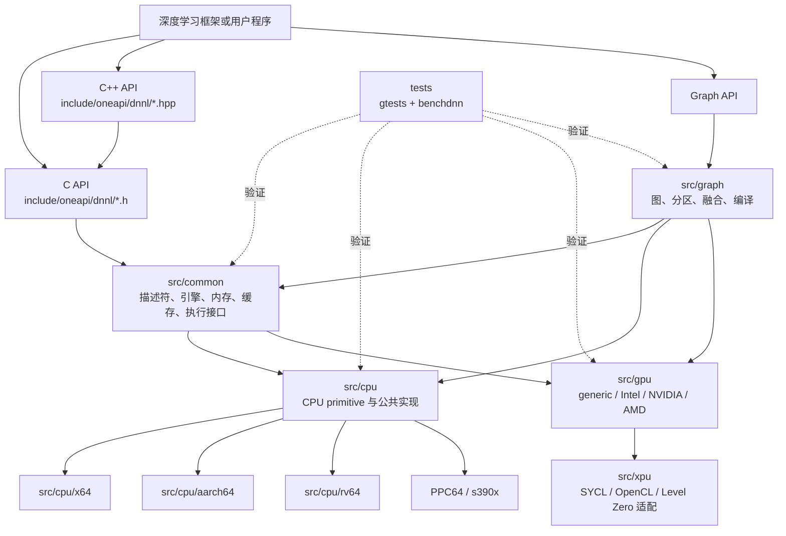
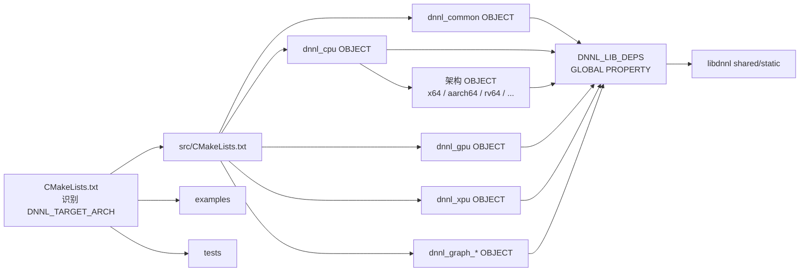
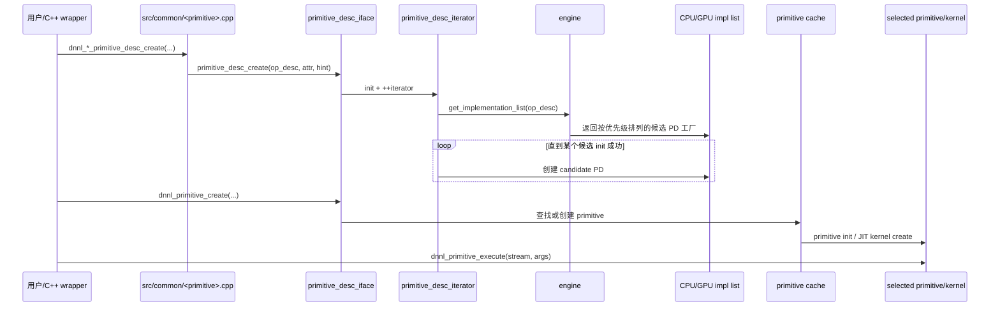
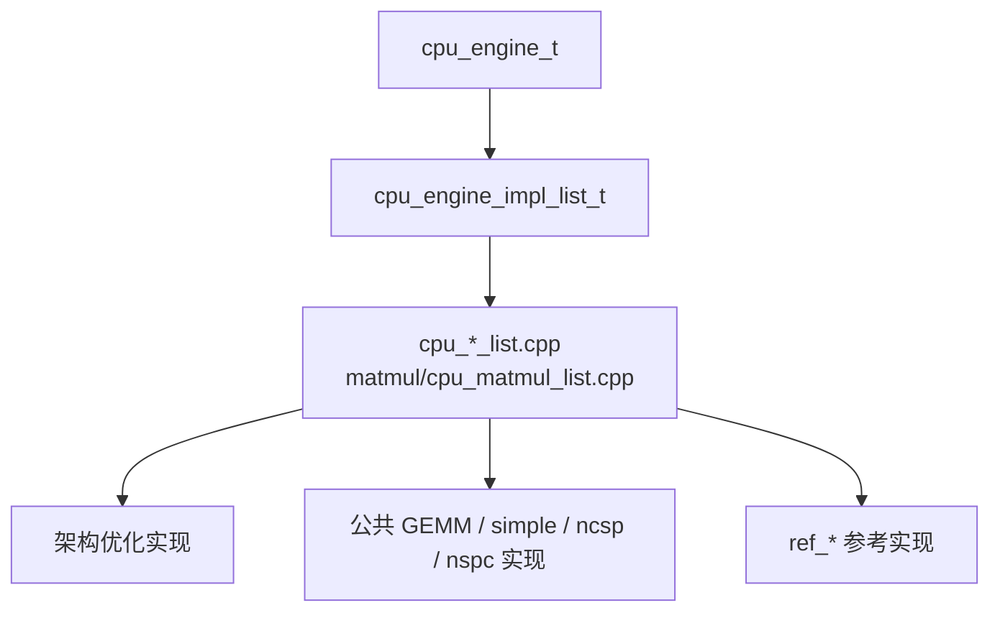
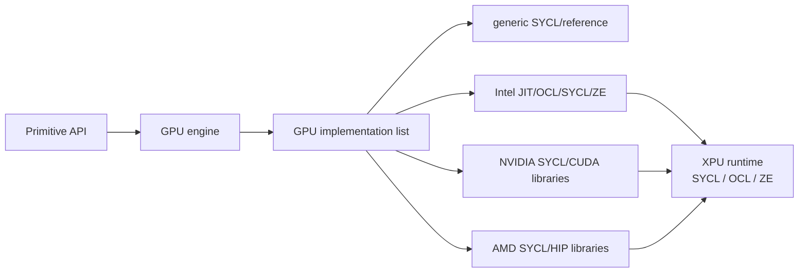
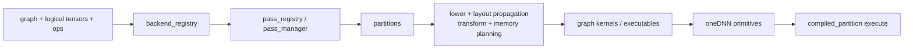

# oneDNN 项目源码地图

> 审计基线：`8f49eae32bdec3674a9a98ea1524a85cd1f302db`（oneDNN 3.14.0）
> 用途：建立模块边界、构建装配关系和运行时调用主干。本文件描述主干，不替代具体架构地图：
> [x64 源码地图](02-x64-source-map.md)、[RV64 源码地图](03-rv64-source-map.md)。

## 1. 一张图看全局

oneDNN 的核心不是“按算子直接调用某个内核”，而是：先构造 operation descriptor，
由 engine 按有序实现列表逐个尝试 primitive descriptor（PD），选择第一个可用实现，
再创建并缓存 primitive，最后在 stream 上执行。

## 2. 顶层目录

| 路径 | 职责 | 审计时关注的边界 |
|---|---|---|
| [`include/oneapi/dnnl`](../../include/oneapi/dnnl) | C/C++、Graph、SYCL、OpenCL、Level Zero、threadpool、uKernel 公共 API | ABI、参数约束、枚举与内部类型映射 |
| [`src/common`](../../src/common) | 公共 descriptor、engine、stream、memory、primitive、属性、缓存、scratchpad、verbose | 所有后端共同的生命周期、所有权和校验 |
| [`src/cpu`](../../src/cpu) | CPU engine、公共/参考实现、实现注册表、GEMM、reorder、RNN | 架构实现的入口不只在架构子目录，注册顺序在这里 |
| [`src/gpu`](../../src/gpu) | generic、Intel、NVIDIA、AMD GPU primitive | vendor 分支、运行时互操作、设备内核 |
| [`src/xpu`](../../src/xpu) | SYCL/OpenCL/Level Zero engine、stream、memory 与 C API 适配 | 跨运行时资源和同步语义 |
| [`src/graph`](../../src/graph) | Graph API、backend registry、pattern passes、partition 编译和执行 | 图融合、layout propagation、内存规划、下沉 primitive |
| [`examples`](../../examples) | C/C++、Primitive、Graph、uKernel 示例 | API 的典型使用方式 |
| [`tests/gtests`](../../tests/gtests) | API、内部组件、回归、Graph 和运行时单元测试 | 小粒度行为与回归覆盖 |
| [`tests/benchdnn`](../../tests/benchdnn) | 各 primitive 的正确性与性能测试驱动 | 数据类型、布局、post-op、方向和边界组合 |
| [`cmake`](../../cmake) | 平台、编译器、运行时、功能裁剪和依赖配置 | 编译宏与实际纳入源码是否一致 |
| [`.github`](../../.github) | CI、lint、跨架构和性能任务 | 架构测试矩阵、跳过项、CI 与真实硬件差距 |
| [`third_party`](../../third_party) | Xbyak、Xbyak_aarch64、Xbyak_riscv、gtest、运行时头文件等 | vendored 代码边界；当前不是 Git submodule |

当前快照的主要规模：`src/cpu` 约 1,002 个文件，`src/gpu` 约 1,005 个文件，
`src/graph` 约 257 个文件，`tests/benchdnn` 约 1,346 个文件。

## 3. 构建装配地图

入口是 [`CMakeLists.txt`](../../CMakeLists.txt)，平台与选项分别由
[`cmake/platform.cmake`](../../cmake/platform.cmake) 和
[`cmake/options.cmake`](../../cmake/options.cmake) 处理。

关键开关：

- `DNNL_TARGET_ARCH` 决定 CPU 架构目录；缺省按 `CMAKE_SYSTEM_PROCESSOR` 识别。
- `ONEDNN_CPU_RUNTIME` 决定 CPU runtime（OMP、TBB、SEQ、THREADPOOL、SYCL 或 NONE）。
- `ONEDNN_GPU_RUNTIME` 与 `ONEDNN_GPU_VENDOR` 决定 GPU/XPU 子树。
- `ONEDNN_BUILD_GRAPH` 决定 Graph 组件。
- `ONEDNN_ENABLE_PRIMITIVE`、`ONEDNN_ENABLE_WORKLOAD` 和 ISA 选项在编译期裁剪候选。
- 各子目录先生成 object library，再把对象追加到 `DNNL_LIB_DEPS`，最终统一链接进 `dnnl`。

## 4. Primitive API 到内核的主调用链

以卷积、MatMul、Pooling 等普通 primitive 为例：

关键文件：

| 阶段 | 文件 |
|---|---|
| 算子 descriptor 与 C API | [`src/common/convolution.cpp`](../../src/common/convolution.cpp)、[`matmul.cpp`](../../src/common/matmul.cpp) 等同名文件 |
| 公共 PD 基类 | [`src/common/primitive_desc.hpp`](../../src/common/primitive_desc.hpp) |
| 遍历候选实现 | [`src/common/primitive_desc_iterator.hpp`](../../src/common/primitive_desc_iterator.hpp) |
| PD 对外接口 | [`src/common/primitive_desc_iface.cpp`](../../src/common/primitive_desc_iface.cpp) |
| primitive 对外接口与执行 | [`src/common/primitive_iface.cpp`](../../src/common/primitive_iface.cpp) |
| engine factory | [`src/common/engine.cpp`](../../src/common/engine.cpp) |
| CPU engine 与算子路由 | [`src/cpu/cpu_engine.hpp`](../../src/cpu/cpu_engine.hpp) |
| 编译期 primitive 裁剪 | [`src/common/impl_registration.hpp`](../../src/common/impl_registration.hpp) |
| primitive/JIT 缓存 | [`src/common/primitive_cache.cpp`](../../src/common/primitive_cache.cpp)、[`kernel_cache.cpp`](../../src/common/kernel_cache.cpp) |
| scratchpad | [`src/common/memory_tracking.cpp`](../../src/common/memory_tracking.cpp)、[`scratchpad.cpp`](../../src/common/scratchpad.cpp) |

实现列表有顺序语义：第一个 `pd_t::init()` 成功的候选通常成为实际实现。
因此“候选顺序错误”和“PD 接受范围过宽”都可能让更合适的内核永远不可达。

## 5. CPU 路径

[`src/cpu/CMakeLists.txt`](../../src/cpu/CMakeLists.txt) 首先编入架构无关 CPU 代码，
随后按 `DNNL_TARGET_ARCH` 加入一个架构子目录。

- [`src/cpu/cpu_*_list.cpp`](../../src/cpu) 保存绝大多数 primitive 的候选表。
- MatMul 候选在 [`src/cpu/matmul/cpu_matmul_list.cpp`](../../src/cpu/matmul/cpu_matmul_list.cpp)。
- Reorder 按源/目标数据类型拆在 [`src/cpu/reorder`](../../src/cpu/reorder) 的多个注册 map 中。
- Concat 和 Sum 有独立的实现列表入口：[`cpu_concat.cpp`](../../src/cpu/cpu_concat.cpp)、[`cpu_sum.cpp`](../../src/cpu/cpu_sum.cpp)。
- 架构优化失败时，候选通常继续落到 GEMM、simple 或 `ref_*` 实现。

## 6. GPU 与 XPU 路径

[`src/gpu/CMakeLists.txt`](../../src/gpu/CMakeLists.txt) 总是先装配 generic GPU 层，
再按 vendor 加入 Intel、NVIDIA 或 AMD 子树。运行时资源由 [`src/xpu`](../../src/xpu) 适配。

Intel GPU 的算子目录按 `conv`、`gemm`、`matmul`、`sdpa` 等划分；
NVIDIA/AMD 路径更多地包装 cuBLAS/cuDNN 或 rocBLAS/MIOpen。

## 7. Graph 路径

Graph API 在 primitive API 之上增加图分析、融合和内存规划：

导航入口：

- 公共对象与 C API：[`src/graph/interface`](../../src/graph/interface)
- backend 注册：[`src/graph/interface/backend.cpp`](../../src/graph/interface/backend.cpp)
- oneDNN backend：[`src/graph/backend/dnnl`](../../src/graph/backend/dnnl)
- 融合模式：[`src/graph/backend/dnnl/patterns`](../../src/graph/backend/dnnl/patterns)
- lowering/pass：[`src/graph/backend/dnnl/passes`](../../src/graph/backend/dnnl/passes)
- primitive 封装：[`src/graph/backend/dnnl/kernels`](../../src/graph/backend/dnnl/kernels)
- 最终执行对象：[`src/graph/backend/dnnl/executables`](../../src/graph/backend/dnnl/executables)

## 8. 测试地图

| 层级 | 位置 | 主要用途 |
|---|---|---|
| 公共/API 单测 | [`tests/gtests`](../../tests/gtests) | API 契约、缓存、线程、格式和回归 |
| 内部 CPU/GPU 单测 | [`tests/gtests/internals`](../../tests/gtests/internals) | BRGEMM、IR、环境变量等内部接口 |
| Graph 单测 | [`tests/gtests/graph`](../../tests/gtests/graph) | API、passes、partition、kernel |
| Primitive 正确性/性能 | [`tests/benchdnn`](../../tests/benchdnn) | driver + reference 计算 + 数据集 |
| 示例级冒烟 | [`examples`](../../examples) | 端到端 API 使用与构建 |
| CTest 组装 | [`cmake/testing.cmake`](../../cmake/testing.cmake)、[`tests/CMakeLists.txt`](../../tests/CMakeLists.txt) | SMOKE、CI、NIGHTLY 集合和过滤 |

`benchdnn` 的一般入口是 `benchdnn --DRIVER ...`。每个 driver 目录同时承担问题解析、
参考结果、比较规则与性能计时，审计算法实现时应同步检查对应 driver 的容差和覆盖维度。

## 9. 面向审计的阅读顺序

1. 从公共 API 对应的 `src/common/<primitive>.cpp` 确认参数如何变成 op descriptor。
2. 在 `src/cpu/cpu_<primitive>_list.cpp` 或 GPU implementation list 中确认候选顺序。
3. 阅读候选 `pd_t::init()`，确认数据类型、布局、shape、prop kind、attribute 和 ISA 的拒绝条件。
4. 阅读 primitive `init()`，确认 JIT、子 primitive、resource 与 scratchpad 的构造。
5. 阅读 `execute()` 的线程划分、offset、尾块和参数包。
6. 阅读 JIT `generate()` 或设备 kernel，核对 ABI、寄存器、mask/tail 和 load/store 边界。
7. 回到 gtests/benchdnn，确认相应组合是否被覆盖以及 CI 是否跳过。

## 10. 地图边界

- 本地图按源码静态关系编制，没有声称每个编译选项下所有模块都存在。
- `third_party` 是依赖边界，修改 vendored JIT emitter 前应先区分 oneDNN 调用错误与 emitter 缺陷。
- 自动生成或大规模生成的 GEMM kernel 应从生成入口和分派表切入，不宜逐文件平铺阅读。
- 架构缺陷审计必须同时覆盖架构目录、共享注册表、平台能力层和该架构 CI；后两者不是附属文件。
