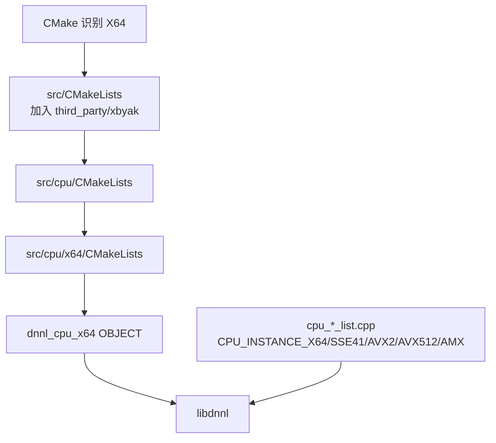
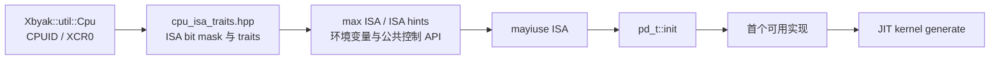
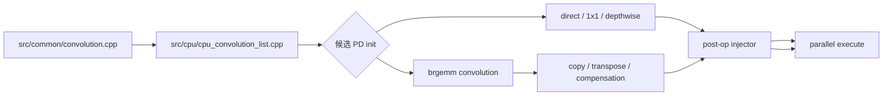

# oneDNN x86-64 源码地图

> 审计基线：`8f49eae32bdec3674a9a98ea1524a85cd1f302db`
> 本项目只支持 64 位平台；源码和构建宏使用 **x64 / `DNNL_X64`**，本文中的“x86 路径”均指 x86-64。

## 1. 路径边界

x64 专用实现集中在 [`src/cpu/x64`](../../src/cpu/x64)，但完整路径还包括：

- 架构识别与编译选项：[`CMakeLists.txt`](../../CMakeLists.txt)、[`cmake/platform.cmake`](../../cmake/platform.cmake)、[`cmake/options.cmake`](../../cmake/options.cmake)
- CPU 实现注册：[`src/cpu/cpu_engine.hpp`](../../src/cpu/cpu_engine.hpp) 和 [`src/cpu/cpu_*_list.cpp`](../../src/cpu)
- 共享 GEMM/MatMul/reorder：[`src/cpu/gemm`](../../src/cpu/gemm)、[`src/cpu/matmul`](../../src/cpu/matmul)、[`src/cpu/reorder`](../../src/cpu/reorder)
- JIT 公共支持：[`src/cpu/jit_utils`](../../src/cpu/jit_utils)
- 指令编码器：[`third_party/xbyak`](../../third_party/xbyak)
- 测试与 CI：[`tests`](../../tests)、[`.github/azure/ci-x64.yml`](../../.github/azure/ci-x64.yml)

当前 `src/cpu/x64` 约 476 个文件、33.5 万行 C/C++，是一个由 primitive wrapper、
配置器、数据变换器、JIT kernel 和公共微内核共同组成的子系统。

## 2. 构建与注册



[`src/cpu/x64/CMakeLists.txt`](../../src/cpu/x64/CMakeLists.txt) 递归纳入 x64 源码，并负责：

- 可选排除 [`zen64`](../../src/cpu/x64/zen64)；启用时链接 ZenDNN，并把相关 target 提升到 C++17。
- 根据 `ONEDNN_ENABLE_GEMM_KERNELS_ISA` 删除高于目标 ISA 的 GEMM kernel。
- 降低大型自动生成 GEMM kernel 的编译优化等级，以控制构建时间和编译器问题。

[`src/cpu/platform.hpp`](../../src/cpu/platform.hpp) 定义 `DNNL_X64_ONLY`、
`REG_SSE41_ISA`、`REG_AVX2_ISA`、`REG_AVX512_ISA`、`REG_AMX_ISA` 等编译期门控；
[`src/cpu/cpu_engine.hpp`](../../src/cpu/cpu_engine.hpp) 将它们包装成 `CPU_INSTANCE_*` 注册宏。

## 3. 运行时 ISA 分派



核心文件：

| 文件 | 职责 |
|---|---|
| [`cpu_isa_traits.hpp`](../../src/cpu/x64/cpu_isa_traits.hpp) | ISA 位模型、traits、Xbyak CPU 对象、AMX/ACE 能力接口 |
| [`cpu_isa_traits.cpp`](../../src/cpu/x64/cpu_isa_traits.cpp) | `get_max_cpu_isa()`、`mayiuse()` 依赖状态、用户 ISA 限制和 hint |
| [`platform.cpp`](../../src/cpu/x64/platform.cpp) | cache/topology、核心类型和平台特性 |
| [`src/cpu/platform.cpp`](../../src/cpu/platform.cpp) | 架构无关接口到 x64 能力层的桥接 |
| [`jit_generator.hpp`](../../src/cpu/x64/jit_generator.hpp) | x64 JIT 基类、ABI 参数寄存器、preamble/postamble、代码注册 |

ISA 主干由 SSE4.1、AVX、AVX2、AVX2 VNNI/VNNI2、AVX-512 core/VNNI/BF16/FP16，
延伸到 AMX 和 AVX10.2/AMX2/ACE。每个 PD 不应仅依赖编译期注册，还必须通过
`mayiuse()`、数据类型、布局与属性约束决定是否接受问题。

## 4. x64 目录地图

```text
src/cpu/x64/
├── cpu_isa_traits.* / platform.* / jit_generator.*  ISA、平台与 JIT 基座
├── jit_* / gemm_bf16_* / ip_convolution.*           大量 primitive 与 kernel 主体
├── brgemm/                                           BRGEMM 描述、分块、容器、JIT 内核
├── gemm/                                             GEMM driver、pack、自动生成与 JIT kernel
│   ├── f32/
│   ├── bf16/
│   ├── s8x8s32/
│   └── amx/
├── injectors/                                        eltwise/binary/sum/post-op 注入器
├── ir/                                               CPU IR、寄存器分配、AVX2 emitter
├── lrn/                                              LRN 专用 executor 与 JIT
├── matmul/                                           BRGEMM MatMul、copy/reorder、稀疏 MatMul
├── prelu/                                            PReLU forward/backward JIT
├── rnn/                                              RNN BRGEMM 与 post-GEMM JIT
├── shuffle/                                          Shuffle JIT
├── ukernel/                                          x64 uKernel API 实现
├── utils/                                            JIT I/O 和寄存器操作辅助
└── zen64/                                            可选 ZenDNN adapter
```

根目录中的文件主要按以下家族命名：

- `jit_uni_*`：同一实现模板覆盖多个 ISA。
- `jit_avx2_*`、`jit_sse41_*`：显式 ISA 专用实现。
- `jit_avx512_common_*`、`jit_avx512_core_*`：AVX-512 家族。
- `jit_brgemm_*`、`jit_brdgmm_*`：BRGEMM/BRDGMM 驱动的 primitive。
- `*_kernel.*`：发射机器码的内核；同名非 kernel 文件通常负责 PD、配置与执行调度。

## 5. 实现注册地图

候选列表保存在共享 CPU 层，而不是 `x64/` 内。下表给出主要入口：

| Primitive | 注册入口 | x64 主实现区域 |
|---|---|---|
| Batch normalization | [`cpu_batch_normalization_list.cpp`](../../src/cpu/cpu_batch_normalization_list.cpp) | `jit_uni_batch_normalization*`、TBB 变体 |
| Binary | [`cpu_binary_list.cpp`](../../src/cpu/cpu_binary_list.cpp) | `jit_uni_binary*`、injectors |
| Convolution | [`cpu_convolution_list.cpp`](../../src/cpu/cpu_convolution_list.cpp) | direct、1x1、depthwise、BRGEMM、AMX、int8/BF16/FP16 |
| Deconvolution | [`cpu_deconvolution_list.cpp`](../../src/cpu/cpu_deconvolution_list.cpp) | BRGEMM 和 convolution 派生实现 |
| Eltwise | [`cpu_eltwise_list.cpp`](../../src/cpu/cpu_eltwise_list.cpp) | `jit_uni_eltwise*`、eltwise injector |
| Group/layer normalization | [`cpu_group_normalization_list.cpp`](../../src/cpu/cpu_group_normalization_list.cpp)、[`cpu_layer_normalization_list.cpp`](../../src/cpu/cpu_layer_normalization_list.cpp) | `jit_uni_*normalization*` |
| Inner product | [`cpu_inner_product_list.cpp`](../../src/cpu/cpu_inner_product_list.cpp) | MatMul adapter、GEMM/BF16、可选 Zen |
| LRN | [`cpu_lrn_list.cpp`](../../src/cpu/cpu_lrn_list.cpp) | [`x64/lrn`](../../src/cpu/x64/lrn) |
| MatMul | [`matmul/cpu_matmul_list.cpp`](../../src/cpu/matmul/cpu_matmul_list.cpp) | [`x64/matmul`](../../src/cpu/x64/matmul)、BRGEMM、Zen、稀疏实现 |
| Pooling | [`cpu_pooling_list.cpp`](../../src/cpu/cpu_pooling_list.cpp) | `jit_uni_pooling*`、int8 pooling |
| PReLU | [`cpu_prelu_list.cpp`](../../src/cpu/cpu_prelu_list.cpp) | [`x64/prelu`](../../src/cpu/x64/prelu) |
| Reduction/resampling | [`cpu_reduction_list.cpp`](../../src/cpu/cpu_reduction_list.cpp)、[`cpu_resampling_list.cpp`](../../src/cpu/cpu_resampling_list.cpp) | `jit_uni_reduction*`、`jit_*resampling*` |
| RNN | [`cpu_rnn_list.cpp`](../../src/cpu/cpu_rnn_list.cpp) | [`x64/rnn`](../../src/cpu/x64/rnn) 与共享 RNN 层 |
| Shuffle/softmax | [`cpu_shuffle_list.cpp`](../../src/cpu/cpu_shuffle_list.cpp)、[`cpu_softmax_list.cpp`](../../src/cpu/cpu_softmax_list.cpp) | `x64/shuffle`、`jit_uni_softmax*` |
| Reorder | [`src/cpu/reorder`](../../src/cpu/reorder) 各数据类型 map | `jit_uni_reorder*`、direct copy、blocked、MatMul copy reorder |

候选排列通常由更专用/更高性能实现开始，最后落到共享或 reference 实现。
审计某个 x64 primitive 时，必须先从注册表确认它在特定数据类型分组中的真实优先级。

## 6. 两条典型调用链

### 6.1 MatMul → BRGEMM


### 6.2 Convolution → direct 或 BRGEMM



## 7. JIT 生命周期


通用 post-op 不一定在 primitive 主 kernel 中手写；应追踪
[`src/cpu/x64/injectors`](../../src/cpu/x64/injectors)。JIT 代码的 profiler/perf 注册则下沉到
[`src/cpu/jit_utils`](../../src/cpu/jit_utils)。

## 8. 实现目录之外的关键依赖

| 区域 | 为什么属于 x64 审计范围 |
|---|---|
| [`src/cpu/platform.cpp`](../../src/cpu/platform.cpp) | 数据类型支持、cache、ISA 控制的公共入口 |
| [`src/cpu/cpu_*_list.cpp`](../../src/cpu) | 决定 x64 实现是否可达以及优先级 |
| [`src/cpu/gemm`](../../src/cpu/gemm) | x64 GEMM driver 的公共入口和 fallback |
| [`src/cpu/reorder`](../../src/cpu/reorder) | x64 reorder 注册散布在按数据类型拆分的文件里 |
| [`src/common/primitive_cache.cpp`](../../src/common/primitive_cache.cpp) | PD/属性/ISA 相关对象的复用边界 |
| [`third_party/xbyak`](../../third_party/xbyak) | 指令编码、CPU 探测和可执行内存 |
| [`tests/test_isa_common.hpp`](../../tests/test_isa_common.hpp) | ISA 控制测试公共辅助 |

## 9. 审计导航

建议每个问题按以下顺序闭环：

1. 注册表中的数据类型分组、prop kind 和候选顺序。
2. `pd_t::init()` 是否完整验证 shape、layout、attribute、post-op 和 ISA。
3. config/blocking 计算中的整数溢出、零维、runtime dimension 和尾块。
4. scratchpad key、大小、对齐和每线程切片。
5. JIT ABI：参数结构 offset、Windows/System V 差异、callee-saved 寄存器和栈对齐。
6. SIMD tail、mask、padding、broadcast、量化补偿与 post-op 顺序。
7. AMX/ACE palette、tile 生命周期及并发状态。
8. primitive/kernel cache 的 key 是否覆盖影响生成代码的全部状态。
9. 在 benchdnn 里用 `--impl`/verbose 确认命中了预期实现，再补最小回归用例。

本地图只描述可达路径，不把 `pd_t::init()` 返回 `unimplemented` 的正常 fallback 视为缺陷。
