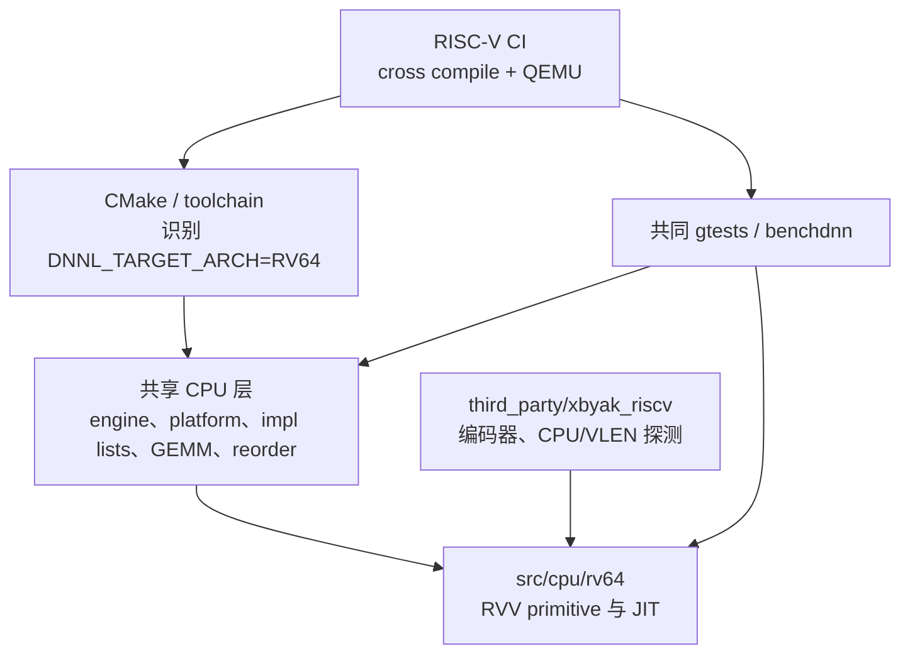
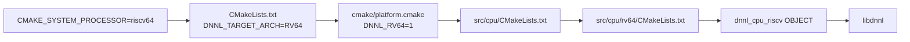
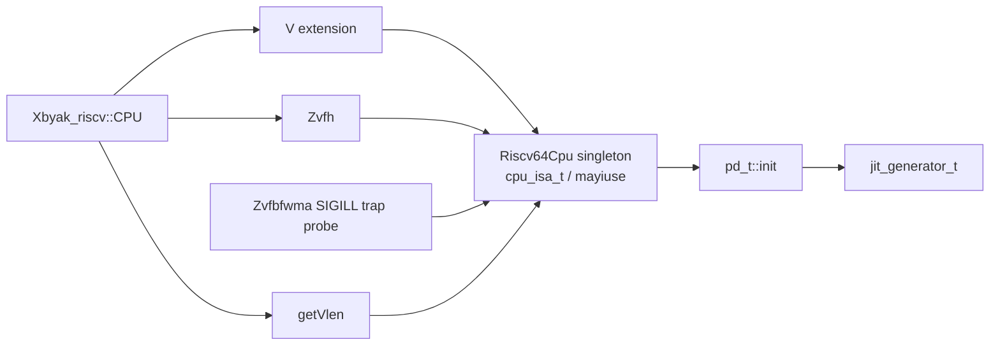
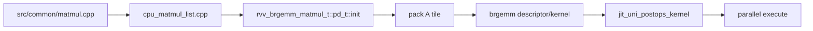
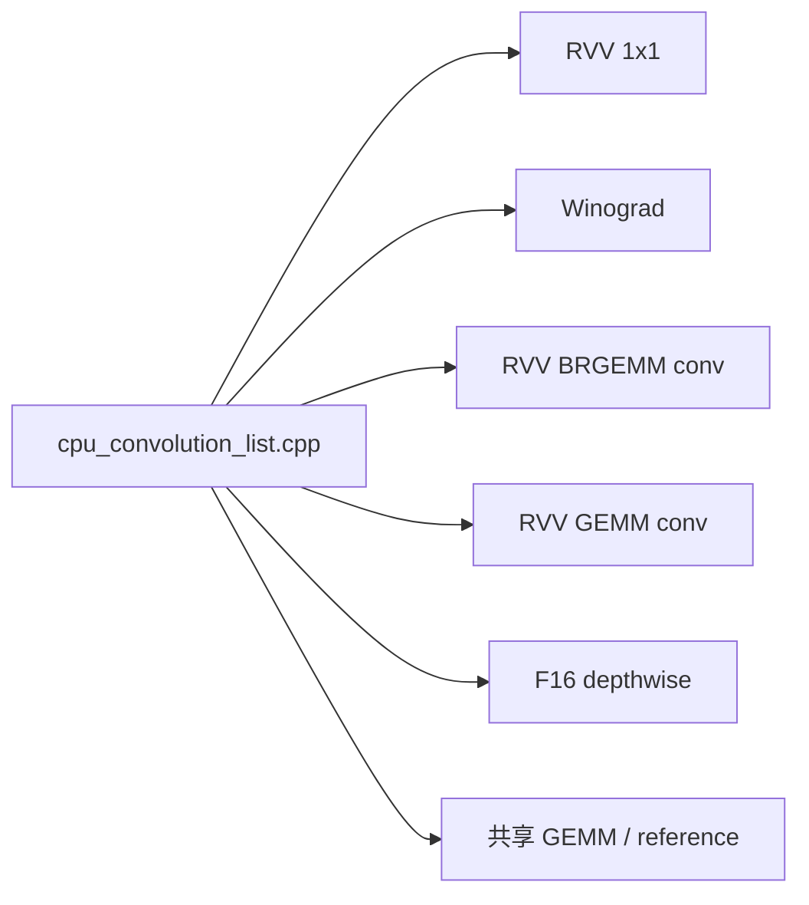
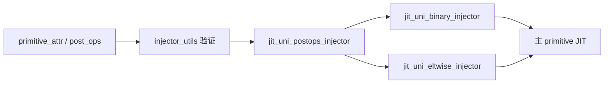
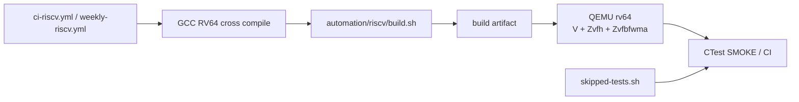

# oneDNN RISC-V（RV64/RVV）源码地图

> 审计基线：`8f49eae32bdec3674a9a98ea1524a85cd1f302db`
> 目标：覆盖 RV64 优化实现、共享注册/平台层、Xbyak_riscv 和 QEMU CI 的完整缺陷审计边界。

## 1. 完整审计边界



直接路径 [`src/cpu/rv64`](../../src/cpu/rv64) 当前约 106 个文件、3.5 万行 C/C++。
但只审查这个目录会漏掉实现注册、数据类型能力、reorder map、GEMM 分派以及 CI 跳过项。

## 2. 构建路径



关键文件：

| 文件 | 作用 |
|---|---|
| [`CMakeLists.txt`](../../CMakeLists.txt) | 从 processor 名称选择 `RV64` |
| [`cmake/platform.cmake`](../../cmake/platform.cmake) | 生成架构编译定义 |
| [`src/CMakeLists.txt`](../../src/CMakeLists.txt) | 为 RV64 加入 Xbyak_riscv include，并装配公共组件 |
| [`src/cpu/CMakeLists.txt`](../../src/cpu/CMakeLists.txt) | 加入共享 CPU/JIT utils 后进入 `rv64` |
| [`src/cpu/rv64/CMakeLists.txt`](../../src/cpu/rv64/CMakeLists.txt) | 递归编译 RV64 文件为 object library |
| [`cmake/toolchains/riscv64.cmake`](../../cmake/toolchains/riscv64.cmake) | Linux RV64 GCC 14 交叉编译工具链 |

当前 RV64 CMake 使用 `file(GLOB_RECURSE ...)`，因此新增 `.c/.cpp/.h/.hpp` 会自动进入该 object target；
能否成为运行时候选仍取决于共享实现列表。

## 3. ISA 与 VLEN 能力层



核心文件是 [`cpu_isa_traits.hpp`](../../src/cpu/rv64/cpu_isa_traits.hpp) 和
[`cpu_isa_traits.cpp`](../../src/cpu/rv64/cpu_isa_traits.cpp)：

- ISA mask 当前包含 `v`、`zvfh`、`zvfbfwma`。
- `Riscv64Cpu` 单例通过 Xbyak_riscv 查询 V、Zvfh 和 VLEN。
- Zvfbfwma 另外通过受 SIGILL handler 保护的原始指令 trap probe 探测，兼容 HWPROBE/cpuinfo 未暴露扩展的机器。
- `get_vlen_implementation_id()` 把 128 起的 2 次幂 VLEN 映射成实现 ID。
- [`src/cpu/platform.cpp`](../../src/cpu/platform.cpp) 用这些能力判断 BF16/F16 数据类型与训练支持。

RVV 调用显式传递 LMUL、tail policy 和 mask policy；项目主动关闭了 Xbyak_riscv 的旧版
`vsetvli/vsetivli` 默认参数。这使 `ta/tu`、`ma/mu` 的选择成为审计重点。

## 4. JIT 基座

[`jit_generator.hpp`](../../src/cpu/rv64/jit_generator.hpp) 封装
`Xbyak_riscv::CodeGenerator`：


- 每个内核必须提供稳定的 `name()` 和 `source_file()`。
- 单个 JIT code buffer 的基准上限为 256 KiB。
- `is_valid_isa()` 同时检查 per-kernel ISA 上限和当前 CPU 能力。
- JIT profiler 注册复用 [`src/cpu/jit_utils`](../../src/cpu/jit_utils)。

## 5. RV64 目录地图

```text
src/cpu/rv64/
├── CMakeLists.txt
├── cpu_isa_traits.*              ISA、扩展探测和 VLEN
├── jit_generator.hpp             Xbyak_riscv JIT 基类
├── jit_primitive_conf.hpp        pooling/resampling/1x1 conv 参数结构
├── brgemm/                       RVV BRGEMM descriptor 与 f32/bf16/f16/int8 JIT
├── gemm/                         f32/f16/s8 GEMM driver、kernel table 与 JIT
├── injectors/                    binary、eltwise、post-op 注入器
├── reorder/                      通用和 blocked reorder JIT
├── shuffle/                      shuffle primitive 与 JIT
├── jit_rvv_*                     1x1 conv、softmax、layernorm、IP 等专用 kernel
├── jit_uni_*                     bnorm、binary、eltwise、pool、prelu、reduction、resampling
├── rvv_brgemm_*                  BRGEMM convolution / inner product / MatMul
├── rvv_gemm_*                    GEMM convolution / inner product
├── rvv_matmul.* / rvv_inner_*    较直接的 MatMul / inner product 路径
└── rvv_winograd_convolution.*    Winograd convolution
```

### 5.1 共享计算骨架

| 子系统 | 入口 | 下游使用者 |
|---|---|---|
| BRGEMM | [`brgemm/brgemm.hpp`](../../src/cpu/rv64/brgemm/brgemm.hpp)、[`jit_brgemm_kernel.hpp`](../../src/cpu/rv64/brgemm/jit_brgemm_kernel.hpp) | MatMul、convolution、inner product |
| GEMM | [`gemm`](../../src/cpu/rv64/gemm) | GEMM API、convolution、inner product |
| Post-ops | [`jit_uni_postops_kernel.hpp`](../../src/cpu/rv64/jit_uni_postops_kernel.hpp) | BRGEMM MatMul/conv/IP 等 |
| Injectors | [`injectors`](../../src/cpu/rv64/injectors) | binary/eltwise 融合、post-op 发射 |
| Reorder | [`reorder`](../../src/cpu/rv64/reorder) | 公共 reorder map、blocked layout |

## 6. 实现注册矩阵

`CPU_INSTANCE_RV64(...)` 定义在 [`src/cpu/cpu_engine.hpp`](../../src/cpu/cpu_engine.hpp)，
真实候选位于共享 CPU 列表。候选只要 `pd_t::init()` 返回成功就会停止继续搜索。

| Primitive | RV64 优化方向/家族 | 注册入口 |
|---|---|---|
| Batch normalization | forward/backward；V、Zvfh | [`cpu_batch_normalization_list.cpp`](../../src/cpu/cpu_batch_normalization_list.cpp) |
| Binary | forward；运行时选择数据类型/ISA | [`cpu_binary_list.cpp`](../../src/cpu/cpu_binary_list.cpp) |
| Convolution | forward；1x1、Winograd、BRGEMM、GEMM、F16 depthwise | [`cpu_convolution_list.cpp`](../../src/cpu/cpu_convolution_list.cpp) |
| Eltwise | forward/backward；V、Zvfh、Zvfbfwma | [`cpu_eltwise_list.cpp`](../../src/cpu/cpu_eltwise_list.cpp) |
| Group normalization | forward | [`cpu_group_normalization_list.cpp`](../../src/cpu/cpu_group_normalization_list.cpp) |
| Inner product | forward；BRGEMM、GEMM、direct/int8 | [`cpu_inner_product_list.cpp`](../../src/cpu/cpu_inner_product_list.cpp) |
| Layer normalization | forward | [`cpu_layer_normalization_list.cpp`](../../src/cpu/cpu_layer_normalization_list.cpp) |
| MatMul | BRGEMM 与 direct RVV | [`matmul/cpu_matmul_list.cpp`](../../src/cpu/matmul/cpu_matmul_list.cpp) |
| Pooling | forward/backward；V、Zvfh、Zvfbfwma | [`cpu_pooling_list.cpp`](../../src/cpu/cpu_pooling_list.cpp) |
| PReLU | forward | [`cpu_prelu_list.cpp`](../../src/cpu/cpu_prelu_list.cpp) |
| Reduction | forward | [`cpu_reduction_list.cpp`](../../src/cpu/cpu_reduction_list.cpp) |
| Resampling | forward；V、Zvfh | [`cpu_resampling_list.cpp`](../../src/cpu/cpu_resampling_list.cpp) |
| Shuffle | forward | [`cpu_shuffle_list.cpp`](../../src/cpu/cpu_shuffle_list.cpp) |
| Softmax | forward | [`cpu_softmax_list.cpp`](../../src/cpu/cpu_softmax_list.cpp) |
| Reorder | direct/blocked JIT，按数据类型 map 注册 | [`src/cpu/reorder`](../../src/cpu/reorder) |

没有 RV64 优化候选或优化 PD 拒绝问题时，会继续尝试共享 GEMM/simple/reference 实现。
Deconvolution、LRN、RNN、Concat、Sum 等仍可能通过共享实现获得功能覆盖，不能把“没有 RV64 专用类”
直接等同于 API 不支持。

## 7. 三条关键数据路径

### 7.1 MatMul → RVV BRGEMM



主 primitive 在 [`rvv_brgemm_matmul.*`](../../src/cpu/rv64/rvv_brgemm_matmul.cpp)，
内核下沉到 [`brgemm`](../../src/cpu/rv64/brgemm)。这里同时交汇 batch/broadcast、
tile packing、scratchpad、数据类型扩展、post-op 和尾块处理。

### 7.2 Convolution 的多候选路径



需要同时阅读 PD 拒绝条件与列表顺序，因为同一个 f32/bf16/f16 问题可能被多个家族声明支持。

### 7.3 Elementwise/Post-op 注入



注入器是跨多个 primitive 的缺陷放大点：broadcast、binary RHS offset、eltwise 近似和寄存器冲突
一旦出错，会同时影响 MatMul、convolution、inner product 等路径。

## 8. 路径外但必须纳入 RV64 审计的文件

| 区域 | 关键文件/目录 | 原因 |
|---|---|---|
| 架构宏 | [`src/cpu/platform.hpp`](../../src/cpu/platform.hpp) | 从编译器宏识别 `DNNL_RV64`，定义 `DNNL_RV64_ONLY` |
| 平台能力 | [`src/cpu/platform.cpp`](../../src/cpu/platform.cpp) | BF16/F16 支持、训练支持、cache 默认值 |
| 实现选择 | [`src/cpu/cpu_*_list.cpp`](../../src/cpu) | RV64 专用实现的入口和优先级 |
| MatMul 选择 | [`src/cpu/matmul/cpu_matmul_list.cpp`](../../src/cpu/matmul/cpu_matmul_list.cpp) | BRGEMM/direct/fallback 顺序 |
| Reorder 选择 | [`src/cpu/reorder`](../../src/cpu/reorder) | `DNNL_RV64_ONLY` 分散在各数据类型 map |
| GEMM API | [`src/cpu/gemm/gemm.cpp`](../../src/cpu/gemm/gemm.cpp) | 架构 GEMM 分派与共享 fallback |
| 公共 JIT | [`src/cpu/jit_utils`](../../src/cpu/jit_utils) | JIT code 注册和 profiler 边界 |
| emitter | [`third_party/xbyak_riscv`](../../third_party/xbyak_riscv) | 指令编码、label/fixup、可执行内存、CPU 探测 |
| 测试 include | [`tests/CMakeLists.txt`](../../tests/CMakeLists.txt) | 为 RV64 测试加入 Xbyak_riscv |
| 特例测试 | [`tests/gtests/test_iface_attr.cpp`](../../tests/gtests/test_iface_attr.cpp) | RV64 当前跳过 depthwise fusion 场景 |

## 9. RISC-V CI 与测试地图



| 文件 | 行为 |
|---|---|
| [`.github/workflows/ci-riscv.yml`](../../.github/workflows/ci-riscv.yml) | PR/推送构建；QEMU VLEN=128、256 执行 SMOKE |
| [`.github/workflows/weekly-riscv.yml`](../../.github/workflows/weekly-riscv.yml) | 每周 CI 集，当前按估算耗时分为 10 份，VLEN=128 |
| [`.github/automation/riscv/common.sh`](../../.github/automation/riscv/common.sh) | 设置交叉编译器与 toolchain |
| [`.github/automation/riscv/build.sh`](../../.github/automation/riscv/build.sh) | RelWithAssert/Release、OMP、Werror、Graph 和测试构建 |
| [`.github/automation/riscv/test.sh`](../../.github/automation/riscv/test.sh) | QEMU 执行、CI 分片、耗时均衡 |
| [`.github/automation/riscv/skipped-tests.sh`](../../.github/automation/riscv/skipped-tests.sh) | 固定失败项和 QEMU 慢测过滤 |

CI 使用的 QEMU CPU 显式启用 `v`、`zvfh`、`zvfbfwma` 和 RVV 1.0。
因此以下差异需要在审计中单独对待：真实硬件 trap/signal 行为、不同 VLEN、扩展缺失组合、
大线程数与弱内存序、QEMU 跳过的长测和性能敏感路径。

## 10. RV64 审计导航

建议按风险从底向上推进：

1. **ISA/探测层**：singleton 初始化、SIGILL handler 恢复、并发/进程信号影响、扩展组合和 VLEN 合法性。
2. **JIT 基座与 emitter 边界**：立即数范围、label/fixup、代码大小、RWE/RX 状态、函数指针 ABI。
3. **RVV 状态**：`vsetvli/vsetivli` 的 SEW/LMUL/VL、`ta/tu`、`ma/mu`，以及 helper 调用后 vtype/vl 是否仍满足假设。
4. **尾块与内存**：masked/tail load-store、padding、非连续 stride、负/超大 offset、零维和 runtime dimension。
5. **共享骨架**：BRGEMM/GEMM packing、batch/broadcast、accumulator 类型、scratchpad 对齐和每线程分区。
6. **注入器**：寄存器保留、binary broadcast、eltwise 精度、post-op 顺序、scale/zero-point mask。
7. **注册与 fallback**：PD 接受范围是否过宽，候选顺序是否遮蔽其他实现，失败状态是否允许正确 fallback。
8. **并发与缓存**：JIT kernel table、primitive cache、静态状态和多 stream/thread 执行。
9. **测试缺口**：对照 `skipped-tests.sh`，补 VLEN=128/256 之外、单扩展缺失、真实硬件和边界 shape 用例。

这份地图不记录具体缺陷结论；后续发现应单独保存复现条件、命中实现名、根因、影响范围和回归测试。
